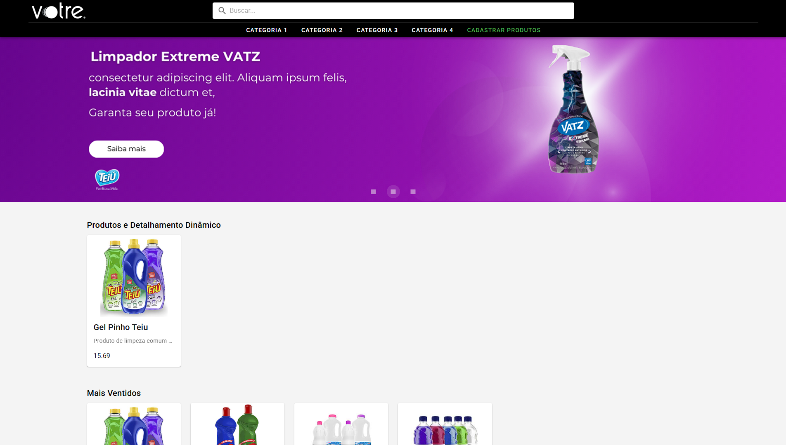

#  Cadastro de Produtos

 Esse aqui é o meu projeto de **cadastro de produtos**. A ideia principal é simples: você consegue **criar**, **editar**, **listar** e **excluir** produtos de maneira bem tranquila, com uma interface bonita e, o mais importante, **reativa** — nada de ficar recarregando a página toda hora.

 

## 🚧 Do que é feito esse projeto?

### 🔙 Back-End

O back foi feito com:

- **PHP**: o coração do servidor.
- **WampServer**: rodando como servidor local.
- **MySQL**: onde todos os dados dos produtos são armazenados.

Não tem muito segredo aqui. Funciona bem e é fácil de configurar.

### 🎨 Front-End

Agora vem a parte que eu curto mais: o front!

- Usei **Vue.js** pra deixar tudo reativo e dinâmico.
- **Vuetify** entrou pra deixar a interface bonita e responsiva.
- E o **Axios** tá por trás da comunicação entre front e back, tudo assíncrono, claro.
- O gerenciamento das dependências foi feito com **npm**, direto do `package.json`.

Ah, importante: usei a **Composition API** do Vue pra deixar o código mais moderno, modular e limpo, tentei manter o código o mais organizado e legível possível, justamente pra quem for olhar depois (ou eu mesmo, daqui uns meses) entender rapidinho.

## ✨ O que dá pra fazer?

Aqui vão as funcionalidades principais do projeto:

- **Cadastrar produtos**: adiciona novos itens no banco com todas as infos necessárias.
- **Editar produtos**: atualiza qualquer produto já existente com facilidade.
- **Listar produtos**: mostra uma lista bonitinha de tudo que já foi cadastrado.
- **Excluir produtos**: remove o produto do sistema se ele não for mais necessário.

Tudo isso sem precisar atualizar a página — é tudo em tempo real, do jeito que a gente gosta!

## ⚙️ Requisitos pra rodar

Antes de iniciar, você precisa ter essas ferramentas instaladas aí no seu PC:

- Vue.js
- PHP
- WampServer
- MySQL
- npm ou yarn

Com isso tudo certo, bora pro passo a passo.

## 🧪 Como rodar o projeto

### 🔧 Back-End

1. Instala o **WampServer** e inicia ele.
2. Cria o banco de dados no **MySQL**.
3. Ajusta as configurações de conexão no arquivo PHP (usuário, senha, banco... aquele esquema básico).
4. Joga os arquivos do back na pasta `www` do WampServer.
5. Confere se a API tá respondendo direitinho.

### 💻 Front-End

1. No terminal, vai até a pasta do projeto.
2. Roda o comando:

   ```bash
   npm install
   ```

3. Depois, inicia o servidor com:

   ```bash
   npm run serve
   ```

4. Agora é só abrir o navegador e acessar:

   ```
   http://localhost:8080
   ```

Pronto! Já pode testar tudo por aí.

## 🧠 Organização do Código

Esse projeto foi feito com cuidado pra ser bem organizado. Usei **Composition API** do Vue, o que deixou tudo mais modular e fácil de entender.

- O **Vuetify** deixa a UI bonita e prática de montar.
- O **Axios** cuida da comunicação com o back sem precisar recarregar nada.
- Tudo tá dividido em **componentes**, pra facilitar a manutenção e a reutilização.

---

Se quiser dar uma olhada no código, contribuir ou só trocar uma ideia, fica à vontade! 🚀
